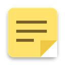
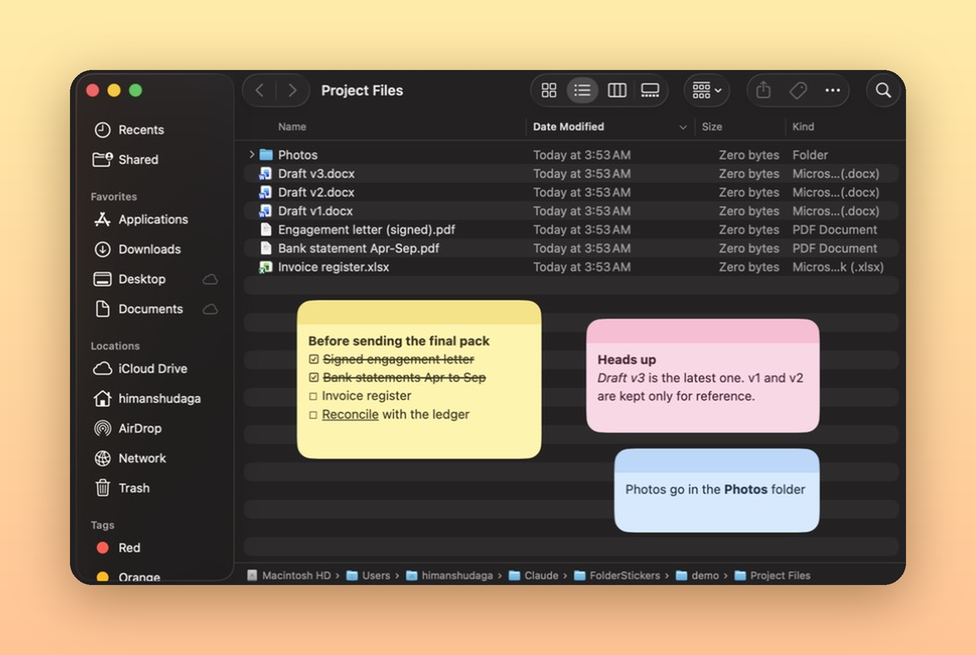
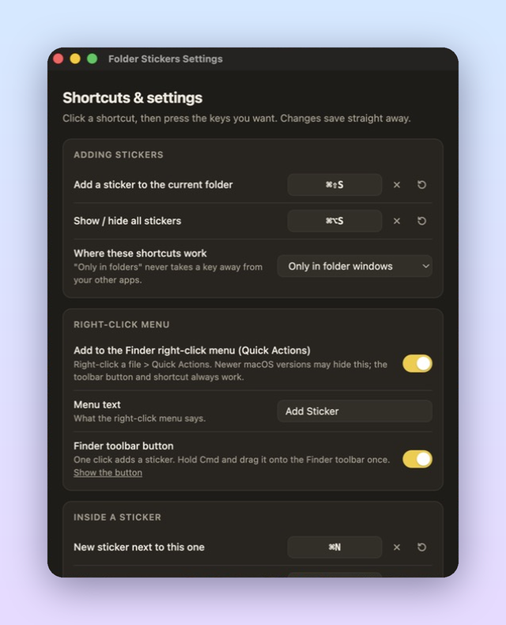

<p align="center">
  
</p>

<h1 align="center">Folder Stickers</h1>

<p align="center">
  <b>Sticky notes that live inside your folders.</b><br>
  Free for Mac and Windows.
</p>

<p align="center">
  <a href="https://github.com/Himanshudaga13/folder-stickers/releases/latest"><b>⬇ Download the latest version</b></a>
</p>

<p align="center">
  
</p>

## What it does

Open any folder, add a sticker, and write on it. Drag it anywhere in the window.
Close the folder and the sticker goes with it. Open the folder again and the sticker is back,
**in the same spot, with the same text**.

Use it to leave yourself reminders exactly where you need them: which file is the final one,
what is still pending, who sent what.

## Features

- **Notes that stay with the folder.** Each note remembers its folder and its position.
- **Formatting:** bold, italic, underline, strikethrough and tick-box checklists.
- **Six colours** and a transparency slider.
- **Follows the window.** Move or resize the folder window and the notes move with it.
  Minimise or close it and they hide.
- **Your shortcuts, your way.** Change every keyboard shortcut and the right-click menu text.
- **Private.** Notes are saved on your own computer, inside the folder. Nothing is uploaded.
- **Light.** Runs quietly in the menu bar (Mac) or system tray (Windows).

## Download and install

Go to **[Releases](https://github.com/Himanshudaga13/folder-stickers/releases/latest)** and pick the file for your computer:

| Your computer | Download |
|---|---|
| Mac with Apple chip (M1, M2, M3, M4) | `Folder-Stickers-x.y.z-arm64.dmg` |
| Mac with Intel chip | `Folder-Stickers-x.y.z-x64.dmg` |
| Windows 10 or 11 | `Folder-Stickers-Setup-x.y.z.exe` |

Not sure which Mac you have? Click the Apple menu > **About This Mac**. "Chip: Apple M…" means Apple chip.

### Mac

1. Open the `.dmg` and drag **Folder Stickers** into **Applications**.
2. Open it from Applications. macOS will say it can't check the app, because it isn't from the App Store.
   Click **Done**, then go to **System Settings > Privacy & Security**, scroll down and click **Open Anyway**.
3. When asked, click **Allow** so Folder Stickers can **control Finder**. This is only used to see
   which folder each Finder window shows.

If macOS says the app "is damaged", open **Terminal** and run this once, then open the app again:

```bash
xattr -cr "/Applications/Folder Stickers.app"
```

### Windows

1. Run `Folder-Stickers-Setup-x.y.z.exe`.
2. If a blue "Windows protected your PC" box appears, click **More info** > **Run anyway**.
   (This shows for any new app that isn't from a big publisher.)
3. Accept the licence and finish the setup. Folder Stickers starts in the system tray.

## How to add a sticker

| | Mac (Finder) | Windows (File Explorer) |
|---|---|---|
| **Keyboard** | Press **⌘⇧S** in any Finder window | Press **Ctrl+Shift+S** in any Explorer window |
| **Mouse** | Click the **Add Sticker** button in the Finder toolbar | Right-click empty space > **Add sticker here** |
| **Menu** | Menu bar icon > Add sticker | Tray icon > Add sticker |

**Add the Finder toolbar button (Mac, one time):** click the Folder Stickers icon in the menu bar >
**Show Finder toolbar button…**, then hold **⌘ Command** and drag **Add Sticker** onto the top bar
of any Finder window.

**Windows 11:** the right-click entry is under **Show more options** (or hold Shift while right-clicking).

## Using a sticker

- **Move:** drag the coloured top bar. **Resize:** drag an edge or corner.
- **Format:** use the buttons in the top bar (they appear when you point at the note), the shortcuts
  below, or right-click inside the note.
- **Checklist:** click ☑ in the top bar. Click a ☐ to tick it. Press Enter for the next item,
  Enter on an empty item to stop.
- **Colour and transparency:** click ◐ in the top bar.
- **Delete:** click ✕. If the note has text, you're asked to confirm.

## Keyboard shortcuts

| Action | Mac | Windows |
|---|---|---|
| Add a sticker to the current folder | ⌘⇧S | Ctrl+Shift+S |
| Show / hide all stickers | ⌘⌥S | Ctrl+Alt+S |
| New sticker next to this one | ⌘N | Ctrl+N |
| Bold / Italic / Underline | ⌘B / ⌘I / ⌘U | Ctrl+B / Ctrl+I / Ctrl+U |
| Strikethrough | ⌘⇧X | Ctrl+Shift+X |
| Checklist item on / off | ⌘⇧C | Ctrl+Shift+C |
| Next colour | ⌘⇧K | Ctrl+Shift+K |
| Delete this sticker | ⌘⇧⌫ | Ctrl+Shift+Backspace |

## Make your own shortcuts

Click the Folder Stickers icon in the menu bar / tray > **Shortcuts & settings…**
(or right-click inside any sticker).

<p align="center">
  
</p>

- Click a shortcut and press the keys you want. It saves straight away.
- **↺** puts back the default. **✕** removes the shortcut.
- Turn the right-click entry on or off, and change what it says.
- Choose whether the add-sticker shortcuts work only in folder windows (default) or everywhere.
- Pick the colour for new stickers, and whether the app starts when you log in.

## Where are my notes saved?

In a hidden file called `.stickers.json` inside each folder. So if you copy, zip, back up or sync the
folder (iCloud, OneDrive, Google Drive, Dropbox), the notes go with it. When you delete the last
sticker in a folder, the file is removed. For read-only folders, notes are kept in the app's own
data folder instead.

## Questions

**Does it slow my computer down?** No. It checks the folder windows a few times a second, which
uses very little power.

**Can I put stickers on the Desktop, Recents or This PC?** No. Those aren't real folders.
Stickers work in any normal folder, including drives and synced folders.

**The "Add Sticker" item doesn't show in the Mac right-click menu.** Newer versions of macOS
hide it. Use the toolbar button or ⌘⇧S instead.

**How do I uninstall?**
- **Mac:** menu bar icon > Shortcuts & settings… > switch off the right-click entry and the
  toolbar button > Quit. Then drag the app from Applications to the Bin.
- **Windows:** Settings > Apps > Folder Stickers > Uninstall.

Your `.stickers.json` files stay in your folders until you delete them.

## Licence

Folder Stickers is **free to use**, at home and at work. It is **not open source**: copying,
modifying, redistributing, reverse engineering or selling it is not allowed.
See the full [Folder Stickers Freeware Licence](LICENSE.txt).

Copyright (c) 2026 Himanshu Daga. All rights reserved.
